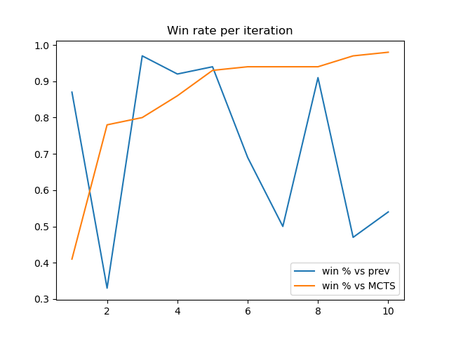
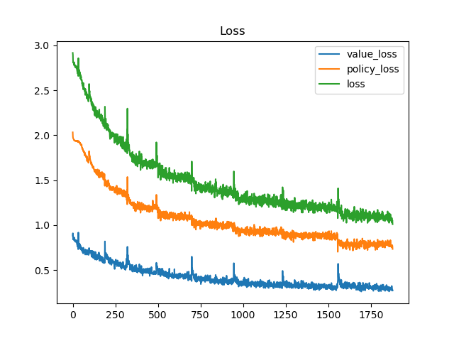
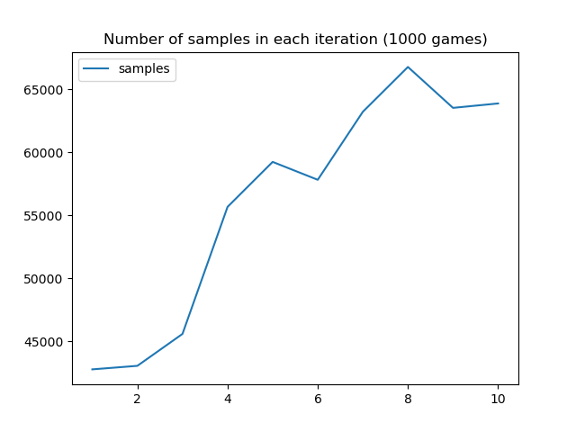
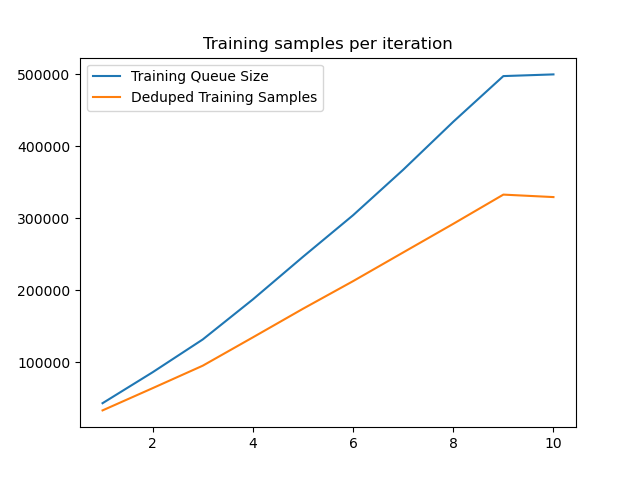

# Alpha Connect
Implementation of the AlphaZero algorithm playing Connect 4 (or any Connect X). The focus is on learning and simplicity.

I tried to follow the AlphaGo Zero paper as faithfully as possible, but there are a few differences:
* Dirichlet noise for exploration wasn't helpful and thus was removed.
* Instead of discarding training samples every time a new model is trained, a FIFO queue of a specified size is kept.
* Observing that there is huge duplication of board states across games (especially in the first few moves), the $(s_t, \pi_t, r_t)$ samples are merged on $s_t$, with $\pi_t$ and $r_t$ averaged out.
* Connect4 has perfect horizontal symmetry, that doubles the amount of samples we get from each self-play.

From my experience, these changes helped training converge faster and perform better.

## Running The Program
### Play
To play with the pre-trained model, run:
```
python alphaconnect/play.py human alphazero -m2 best.model
```
Evaluate different agents by playing a number of games:
```
python alphaconnect/play.py minimax alphazero -m2 best.model --num_games 10
```
For more options, check
```
python alphaconnect/play.py --help
```
### Train
To train the model, run:
```
python alphaconnect/train.py --run_dir <run_dir>
```
Where `run_dir` will be a directory that stores the logs/metrics/self-play samples/model of each run. 

If `run_dir` is pointing to an unfinished/interrupted run, then the training script will (do its best) to continue the previous run.

Check `python alphaconnect/train.py --help` for all hyperparameter options, and check the Params class under [train.py](alphaconnect/train.py) for further clarifications.

## Training Notes
I trained my models on an AMD Ryzen 5 5600X, 16GB RAM, GeForce RTX 2070 Super Black (8GB VRAM)

The best model was trained with the following parameters:
```
{
  "self_play_iterations": 10,
  "self_play_games": 1000,
  "sample_queue_size": 500000,
  "arena_games": 100,
  "dedupe_samples": true,
  "tree_iterations": 500,
  "cpuct": 3,
  "temp_change_step": 15,
  "layers": 8,
  "filters": 128,
  "batch_size": 1024,
  "lr": 0.001,
  "weight_decay": 0.0001,
  "processes": 8,
  "device": "cuda",
  "seed": 42,
  "run_dir": "<run_dir>"
}
```

The particular training run took around 16 hours in total, with the earlier iterations finishing faster than the later ones (longer games as the model gets better).

### Win Rate
After each iteration, the newly trained model plays against both the previous model and a simple MCTS model as a baseline.

The new model quickly surpasses the pure MCTS implementation, but starts to even out against the previous models in later stages of training.

### Loss
We are optimizing against a moving target, as the training samples are updated with each iteration. Still, we can observe the loss trending down with each batch.


### Sample Sizes
We can see that the games get longer (we collect more samples in the same number of games) as our model trains:


Note that since we are using a sample queue, the number of samples used in training grows in each iteration, until the limit is reached:


_These graphs were generated in [this notebook](doc/analysis.ipynb)_